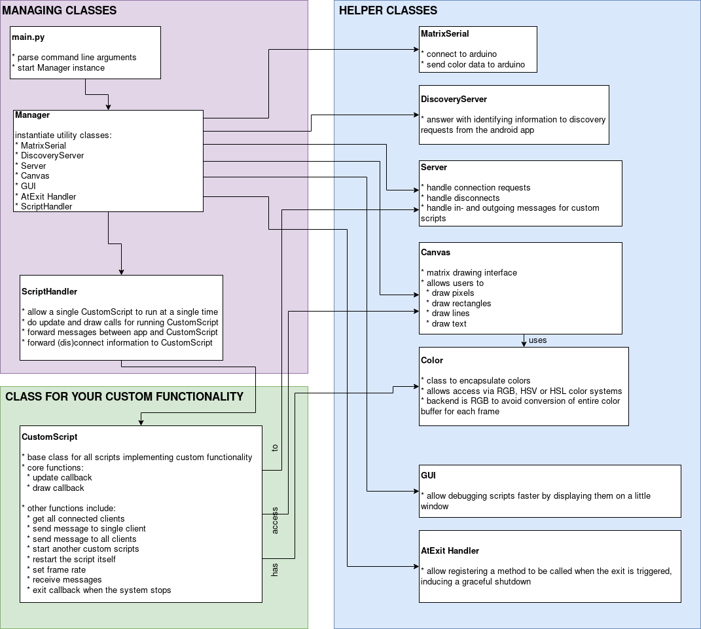

.. iot-ledmatrix documentation master file, created by
   sphinx-quickstart on Tue Mar 28 19:35:56 2017.
   You can adapt this file completely to your liking, but it should at least
   contain the root `toctree` directive.

Welcome to iot-ledmatrix's documentation!
=========================================

iot-ledmatrix is the code written by `enra64 <github.com/enra64>`_ and `gSilas <https://www.github.com/gSilas>`_ to use their DIY IOT WS2812B RGB LED matrix.

If you want to build a similar project, feel free to use any of our source code. It is licensed under GPL v3.
If you are so inclined, you can even use the complete code base and add any functionality you desire using our custom script interface.

The code consists of three parts:

* the python code used on the raspberry pi inside the matrix
* the android code making up the control app
* the arduino code required to talk to the leds

This documentation is mostly concerned with the python code used on the rpi, since at the moment the other code
is only written by enra64 and not really subject to change.

Raspberry pi (host) code
========================
The raspberry pi code is responsible for pushing the correct colors to the arduino,
and also constitutes the bridge between the matrix, the internet and an optional android phone.

architecture
------------

    An overview of the architecture used by the host code

If you're like me, you like to have some semblance of an idea of how the code is structured, so here is an architecture diagram to show exactly that.

custom scripts
--------------
Custom scripts enable you to easily create new features for the matrix. They are discussed in detail here: :ref:`custom_script_label`

how to get it running on your raspberry pi
------------------------------------------

1) update apt: `sudo apt update`
2) get some required packages: `sudo apt install git python3-pip python3-venv`
3) download the code using git clone for easy updating: `git clone https://github.com/enra64/iot-ledmatrix.git`
4) create a python3 venv: `python3 -m venv ./host-venv`
5) activate the venv: `source host-venv/bin/activate`
6) install the required packages within the venv: `pip install -r iot-ledmatrix/host/requirements.txt`

android code
============
The android app included in client-android makes working with the matrix really easy. It supports some administration features, and it is the basis for interactive scripts.

administration
--------------
Users can reboot the raspberry pi, shut it down or simply restart the host code. A log viewer is also implemented, so failures can be quickly debugged.

host script fragments
---------------------
Programmers can write Fragments that display an arbitrary user interface to implement any required custom functionality.
Two-Way communication with the matrix is available.

arduino sketch
==============
The arduino code is simple, but ``NUM_LEDS_CURRENT`` must be set before uploading the code.
The arduino will partake in a simple handshake to confirm correct initialization.
After that, the arduino writes all received data into the led buffer.
Whenever enough bytes for a single frame have arrived, the leds will show the new data.
